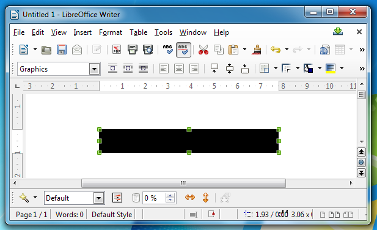
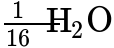
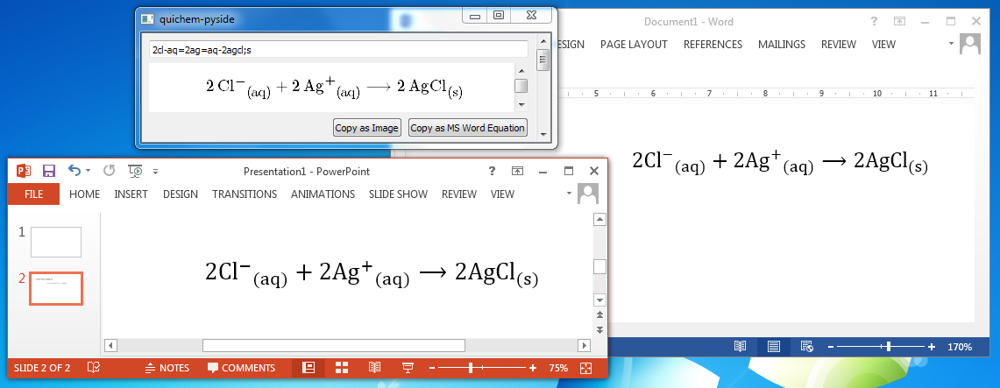
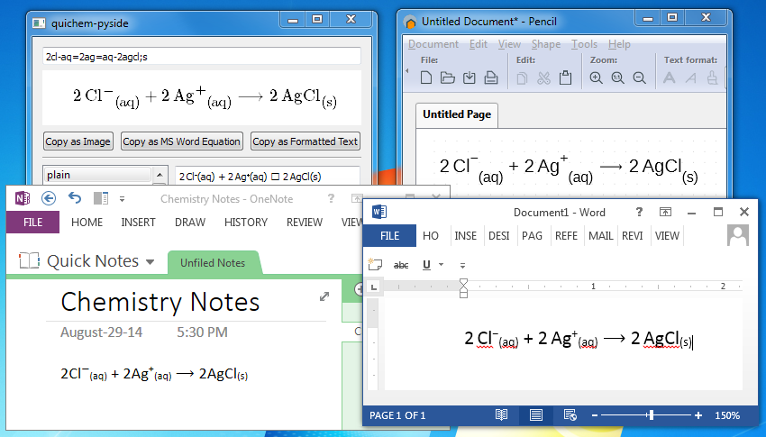
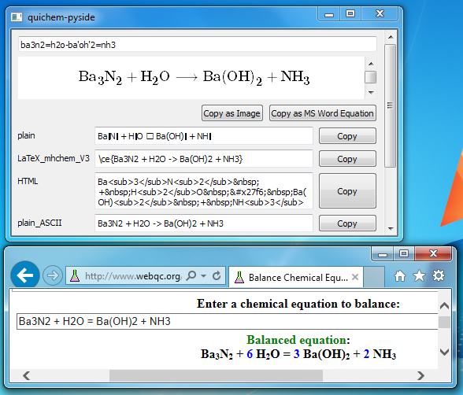

.. _SourceForge web page: http://sourceforge.net/projects/quichem
.. _GitHub web page: https://github.com/spamalot/quichem/blob/master/SYNTAX.rst
.. _report it as a bug: https://github.com/spamalot/quichem/issues/new

=============================
``quichem-pyside`` User Guide
=============================

Thanks for trying out ``quichem-pyside``. I've written this user guide as an
informal, technical-jargon-free place for chemists to get started using
``quichem`` on Windows (and other operating systems too).

``quichem`` (pronounced *[kwi-kehm]*) is a utility written in pure Python
designed to take the pain out of typing chemical equations into the computer.
For example, typing in ``h=aq=cl-aq`` will create an output of:

.. container:: eqn

    H\ :sup:`+`\ :sub:`(aq)`\  + Cl\ :sup:`−`\ :sub:`(aq)`.

``quichem-pyside`` is a graphical program which makes use of the ``quichem``
utility.

.. note::

    Several images in this document may depict previous versions of
    ``quichem``. However, the functionality demonstrated in these images
    is unchanged in up-to-date versions.

.. contents::
    Table of Contents

Installation on Windows
-----------------------

To get started with ``quichem`` on Windows, head over to the ``quichem``
`SourceForge web page`_ and download the latest version using the green
download button. This will download a zip file on to your computer. Extract the
zip file by right clicking on it and selecting "Extract all...". In the
extracted folder, there will be a folder named "quichem-pyside". Inside this
folder will be a bunch of files. Double click on **quichem-pyside.exe** and
``quichem`` will run.

Currently, ``quichem`` only comes in a portable format, meaning that you don't
actually install it. This has the advantage that you can easily put ``quichem``
on a USB key and use it on any computer.

Getting Started
---------------

Now that ``quichem`` is open, you should see a screen like this:

.. figure:: images/start.png
    :width: 50%
    :align: center

    ``quichem-pyside`` *upon being opened*

The text box at the top of the window is where you can enter chemical
equations as described below in the `Syntax`_ section. The large empty area
immediately below is where a formatted chemical equation will appear when you
start typing. Below that is a collection of boxes which will each render your
equation in various different formats, as described in `Output Formats`_.

Example 1
+++++++++

Let's jump right in and try an example. If you feel like you need to see some
theory first, have a look at the `Syntax`_ section and then come back here.

To start off, we will try the following net ionic equation:

.. container:: eqn

    H\ :sup:`+`\ :sub:`(aq)`\  + OH\ :sup:`−`\ :sub:`(aq)`\  ⟶ H\ :sub:`2`\ O\ :sub:`(ℓ)`

I'll break the answer into parts. To make H\ :sup:`+`\ :sub:`(aq)`, type in
``h=aq``. The ``h`` is the hydrogen. The ``=`` is the positive charge. Why
``=`` and not ``+``? You don't have to press Shift. This saves you time and
effort, but you don't have to think about it because ``=``, and ``+`` are on
the same key. The ``aq`` is the aqueous state. You don't have to bother putting
brackets around the state because ``quichem`` does that for you. Put the pieces
together again, and we have ``h=aq``: a hydrogen that is positively charged and
aqueous.

OH\ :sup:`−`\ :sub:`(aq)` can be achieved in much the same way as H\ :sup:`+`\
:sub:`(aq)`. The input to make it is ``oh-aq``.

Based on what you know so far, H\ :sub:`2`\ O\ :sub:`(ℓ)` should be relatively
easy to input as well. The input to make it is ``h2ol``. Note that we don't
need a separator between the oxygen and the liquid state (because ``l`` is not
an element so it's obviously a state).

Now that we have all the parts of the equation, we can put them together. A
plus sign for adding chemical formulae together is once again created with an
``=``. A forward reaction arrow is created with a ``-``, like the negative
charge. Therefore, to make the final equation, we take ``h=aq``, ``=``,
``oh-aq``, ``-``, and ``h2ol``, and stick them together to get:
``h=aq=oh-aq-h2ol``. This is our final input. By typing this in, we finally
get:

.. container:: eqn

    H\ :sup:`+`\ :sub:`(aq)`\  + OH\ :sup:`−`\ :sub:`(aq)`\ ⟶ H\ :sub:`2`\ O\ :sub:`(ℓ)`

Example 2
+++++++++

Let's do another example:

.. container:: eqn

    CaCl\ :sub:`2(aq)`\  + 2 AgNO\ :sub:`3(aq)`\  ⟶ Ca(NO\ :sub:`3`\ )\ :sub:`2(aq)`\  + 2 AgCl\ :sub:`(s)`

CaCl\ :sub:`2(aq)` should be easy now based on the first example. It can be
achieved with ``cacl2aq``. 2 AgNO\ :sub:`3(aq)` is where the trouble starts.
You can try entering it as you think you would, but you will find that you get
2 AgNo\ :sub:`3(aq)`. Oh no! Not *Nobelium*! Luckily for us, ``quichem``'s
misinterpretation is easy to fix. Simply add a dot (``.``) between the ``n``
and the ``o``, and you will get 2 AgNO\ :sub:`3(aq)` as expected.

.. note::

    You may find it very odd that ``quichem`` would interpret ``no`` as No and
    not NO, considering that NO is much more common in chemistry than No. If
    you care to know why ``quichem`` takes the less common choice, this note
    explains. Consider this: say ``quichem`` did in fact interpret ``no`` as
    NO, but you happened to want to input No. There would be no clear way
    to do this. While it is easy to split ``n`` and ``o``, it is not easy to
    join them together when they already are together. Of course, we could come
    up with a way, but ``no`` isn't the only ambigous input you can give
    ``quichem``. Therefore, I've found that using a dot as a separator
    ("disambiguifier") will give a good balance between consistency and
    flexibility.

Now we get to one of my favourite parts: parentheses (round brackets). The
reason I like these so much is that ``quichem`` automatically determines which
parentheses are open parentheses *"("* and which parentheses are close
parentheses *")"*.
This way I don't have to worry about accidentally pressing the key for the
wrong parenthesis. The symbol chosen for any parenthesis was a single quote
(``'``). I chose this because it is (depending on the font) symmetrical, and
relatively close the the parentheses on the keyboard. As such,
Ca(NO\ :sub:`3`\)\ :sub:`2(aq)` would be rendered with the input
``ca'n.o3'2aq``. Everything but the brackets is exactly as you would expect,
including the dot so we don't end up with *Nobelium* again.

2 AgCl\ :sub:`(s)` should now be a piece of cake to input. Now you can take all
of your parts: ``cacl2aq``, ``=``, ``2agn.o3aq``, ``-``, ``ca'n.o3'2aq``, ``=``
and ``2agcl;s``, and combine them to get a final input of
``cacl2aq=2agn.o3aq-ca'n.o3'2aq=2agcl;s``.

Conclusion
++++++++++

These examples only brush the surface of what ``quichem`` is capable of. To see
everything that ``quichem`` can do, see the `Syntax`_ section below.

As you practise, your speed will improve exponentially and you won't have to
think about "combining the parts together" any more.

Syntax
------

The *syntax*, or "language", or "input format" of ``quichem`` is broken down
into many small parts, just like a real language is broken down into verbs,
nouns, adjectives, and other less common parts.

The full syntax description of ``quichem`` is available on ``quichem``'s
`GitHub web page`_. It explains every aspect of what you can input in
``quichem``, and is chock-full of specific examples.

Output Formats
--------------

``quichem`` has a variety of output formats to suit many people's needs. The
output formats are described below.

"Copy as Image"
+++++++++++++++
By clicking on the button labelled "Copy as Image", you are putting an image of
the chemical equation into your computer's clipboard. This means you can paste
the image into different applications installed on your computer with Ctrl+V
or with Right-Click Paste. If pasting doesn't work, the program you are
pasting in doesn't support the file format that ``quichem`` uses for images.

.. figure:: images/image.png
    :width: 50%
    :align: center

    *An image created in* ``quichem-pyside`` *that has been pasted into an
    image editor*

In many programs, this pasted image can now be resized and moved around as
you like. However, you cannot use quichem to change the text in an image
after it has been pasted.

Troubleshooting
~~~~~~~~~~~~~~~

**When I paste, I get a black rectangle, like:**

There is a bug in several programs (notably OpenOffice and LibreOffice) that
prevents proper pasting of images with transparency. Until such programs
fix this bug, paste the image from ``quichem`` into an image program on top
of the background colour of your choice. Then copy this from the image program
into the problematic program.

**Fraction lines are too long, like:**

You may find that this also happens in the preview area in the ``quichem``
window.

If you are running Windows, `report it as a bug`_. (Note you will need a GitHub
account.) Otherwise, if you are using Linux or another operating system, this
appears to be caused by a known bug and unfortunately cannot be resolved.

.. note::

    **For technical users:** This bug is in the web rendering engine used by
    ``quichem`` (WebKit). Because this is currently beyond my control, you
    will have to wait until the bug is fixed and then merged into the GUI
    toolkit used by ``quichem`` (PySide [Qt]).

This overly-long fraction line will only impact the preview window and the
images copied from ``quichem``. All other output formats, including MS Word
Equations, will be **unaffected**.

"Copy as MS Word Equation"
++++++++++++++++++++++++++

If you want to use ``quichem`` output with Microsoft Word 2007 or newer, you
can use the button labelled "Copy as MS Word Equation" to do so. When you
click this button, you can now paste the equation into Microsoft Word with
Ctrl+V or with Right-Click Paste. An equation box containing the chemical
formula should appear. You can now manipulate it as you would any other
Microsoft Word Equation.

.. figure:: images/wordeq.png
    :width: 50%
    :align: center

    *A chemical equation created in* ``quichem-pyside`` *that has been pasted
    into Microsoft Word*

Unfortunately, you can't paste MS Word Equations from ``quichem`` directly into
PowerPoint. Instead, paste in Word, copy the equation that appeared in Word,
and then paste that into PowerPoint.

    *A chemical equation created in* ``quichem-pyside`` *that has been
    transferred to Microsoft PowerPoint*

Using the "Copy as MS Word Equation" button has many advantages to using the
"Copy as Image" button. Unlike images, Microsoft Word equations can be resized
without pixelization or loss of quality. They can also be manually tweaked
later on.

Troubleshooting
~~~~~~~~~~~~~~~

**I get a bunch of random text instead of an equation, like**::

    <?xml version="1.0"?>
    <math xmlns="http://www.w3.org/1998/Math/MathML">
      <msub>
        <mrow class="MJX-TeXAtom-ORD">
          <mi mathvariant="normal">H</mi>
        </mrow>
        <mrow class="MJX-TeXAtom-ORD">
          <mn>2</mn>
        </mrow>
      </msub>
      <mrow class="MJX-TeXAtom-ORD"><mo>&#x180e;</mo>  </mrow>
      <mrow class="MJX-TeXAtom-ORD">
        <mi mathvariant="normal">O</mi>
      </mrow>
    </math>

This output could be obtained for various reasons. Ensure:

- you are pasting into Microsoft Word and not another program such as
  OpenOffice of Microsoft Excel.
- you are pasting into Microsoft Word 2007 or newer. This will **not** work in
  Word 2003.

Still not working? `Report it as a bug`_! (Note you will need a GitHub
account.)

"Copy as Formatted Text"
++++++++++++++++++++++++

If you want to use ``quichem`` output with programs that support editing of
formatted text (e.g. Microsoft Word), you can use the "Copy as Formatted Text"
button. When you click this button, you can now paste the equation into many
formatted text editing applications with Ctrl+V or with Right-Click Paste. If
the software you are pasting into doesn't support formatted text, quichem will
paste plain text instead.

    *A chemical equation created in* ``quichem-pyside`` *that has been pasted
    into various programs which support formatted text editing.*

Plain Text: ``plain``
+++++++++++++++++++++

The plain text output was designed for situations where you want to have a
pretty chemical equation, but where you aren't able to use formatted text.
Emails are a good example of where plain text output would be useful.

.. figure:: images/email.png
    :width: 50%
    :align: center

    *A chemical equation created in* ``quichem-pyside`` *that has been pasted
    into an email*

Plain text output will not work on computers with old operating systems (e.g.
Windows 2000, Windows XP machines that haven't been updated in years, etc.) or
with older software. For compatibility with these systems and with this
software, use the `plain text ASCII output`_ instead of plain text output.

Troubleshooting
~~~~~~~~~~~~~~~

**Parts of the equation look like ? when I paste it**

You see this funny character because your computer (either the operating system
or the program you are using) is unable to display a part of the equation
properly. You can try resolving this by pasting into a different program. If
the problem persists, use a different computer or paste the
`plain text ASCII output`_ instead of the plain text output.

.. _plain text ASCII output:

Plain Text for Old Computers: ``plain_ASCII``
+++++++++++++++++++++++++++++++++++++++++++++

The plain text ASCII output was designed with old computers and online software
in mind. If you need unformatted output compatible with older computers, plain
text ASCII output is what you should use. This output format is most similar to
what you would type into programs like online chemical equation balancers, so
with minimal tweaking, you can take this output and use it with such programs.

    *A chemical equation created in* ``quichem-pyside`` *that has been pasted
    into an online chemical equation balancing tool*

Web Page Format: ``HTML``
+++++++++++++++++++++++++

Use HTML output if you are putting chemical equations in a web page. (Also,
many forums and online discussion groups which allow formatted text can
understand this format).

.. figure:: images/html.png
    :width: 50%
    :align: center

    *A chemical equation created in* ``quichem-pyside`` *that has been added
    to a web page*

.. hint::

    Personally, I prefer using the `LaTeX output`_ and then rendering it with a
    JavaScript tool called MathJax, however this requires significantly more
    set-up and web programming knowledge (and it needs JavaScript).

.. _LaTeX output:

Typeset Documents: ``LaTeX`` and ``LaTeX_mhchem_V3``
++++++++++++++++++++++++++++++++++++++++++++++++++++

.. note::

    If you don't know what LaTeX is (no, I'm not referring to the plastic), you
    will not find this section relevant.

For researchers, students and others who need to put chemical equations in
LaTeX documents, ``quichem`` can export to two different formats compatible
with LaTeX. The ``LaTeX`` format uses pure LaTeX for output, which means that
you don't have to include any additional packages. The output is contained in a
math environment, which means that the chemical equation will be typeset using
the font that you specified for your math environments.

The second LaTeX format that ``quichem`` exports to is ``LaTeX_mhchem_V3``. If
you have the ``mhchem`` package installed, put ``\usepackage{mhchem}`` in
your document header and then you can use the ``LaTeX_mhchem_V3`` output in
your document. This has the disadvantage that you need to include an extra
package, but the advantage that the chemical equation in the rendered LaTeX
document will look more professional than that rendered with the ``LaTeX``
output.

.. hint::

    I recommend using ``mhchem`` version 3.15 or newer, because its output has
    better consistency with international style guidelines than its older
    versions.

``reStructuredText``
++++++++++++++++++++

.. note::

    If you don't know what either Markdown or reStructuredText are, you
    will not find this section relevant.

reStructuredText is a markup language similar to Markdown. It is used by
many programmers to write documentation for code, but can be used outside
this domain as well. In fact, reStructuedText was used to write this
User Guide, and all of the chemical equations in this document were created
with ``quichem``.

.. hint::

    If you need ``quichem`` to create output for Markdown, the ``HTML``
    output will work directly.
